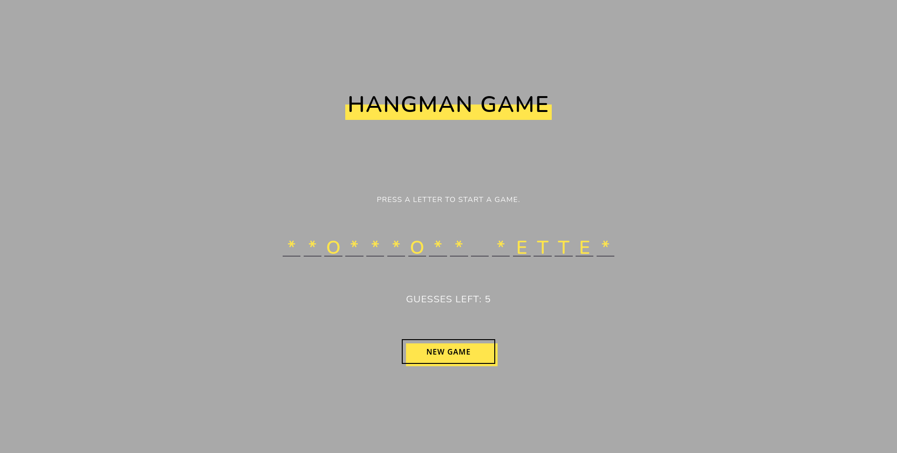

# Simple Hangman Game

## Description
* The round automatically starts when the page loads.
* You can guess the letters using your keyboard. 
* Only accepts english letters right now.
* If you press an already guessed letter, then the remaining guesses counter won't decrease.
* Currently only works on PC.
## Try it out
* [Play a game](https://cryptic-deer.github.io/Simple-Hangman-Game)
## Built by using
* Html
* CSS
* JavaScript
## Acknowledgments
* Thanks [Andrew Mead](https://twitter.com/andrew_j_mead) for his random phrase generator.
